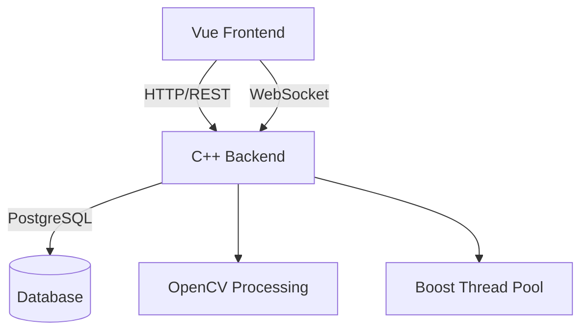

# EnderLabel

EnderLabel: A C++-Driven Semi-Automated System for AI Image Dataset Annotation

## System Architecture

### Overview

A decoupled frontend-backend system designed for high-performance computing:

- **Frontend**: Vue.js (v3) - Responsive web interface
- **Backend**: C++ - Core computation engine
- **Communication**: REST API + WebSocket

## Technical Specifications

| Library          | Version | Key Functions                                                                 |
|------------------|---------|-------------------------------------------------------------------------------|
| OpenCV           | 4.6.0   | Real-time image processing, feature detection, and computer vision algorithms |
| Oat++            | 1.3.0   | High-performance C++ web framework for building REST APIs                     |
| Oat++ WebSocket  | 1.3.0   | WebSocket protocol implementation for real-time bidirectional communication   |
| Oat++ PostgreSQL | 1.3.0   | PostgreSQL database connector with async query support                        |
| Oat++ Swagger    | 1.3.0   | Automatic API documentation generation (OpenAPI 3.0)                          |
| Oat++ cURL       | 1.3.0   | HTTP client implementation based on libcurl                                   |
| PostgreSQL       | 14      | Relational database management system for structured data storage             |
| Boost            | 1.70.0  | Cross-platform utilities (ASIO for async I/O, Thread for multi-threading)     |
| OpenSSL          | 3.0     | Cryptography toolkit for secure communications (TLS/SSL)                      |

## Cross-Platform Compatibility

### Supported Platforms

| OS        | Tested Versions                      | Build System                    | Package Management |
|-----------|--------------------------------------|---------------------------------|--------------------|
| **Linux** | Ubuntu 20.04/22.04 LTS CentOS 7/8 | CMake 3.21+                     | APT/YUM            |
| Windows   | Windows 10/11                        | Visual Studio 2022 MinGW-w64 | vcpkg/msys2        |
| macOS     | Monterey (12.6+)                     | Xcode 14+ Homebrew           | Homebrew           |